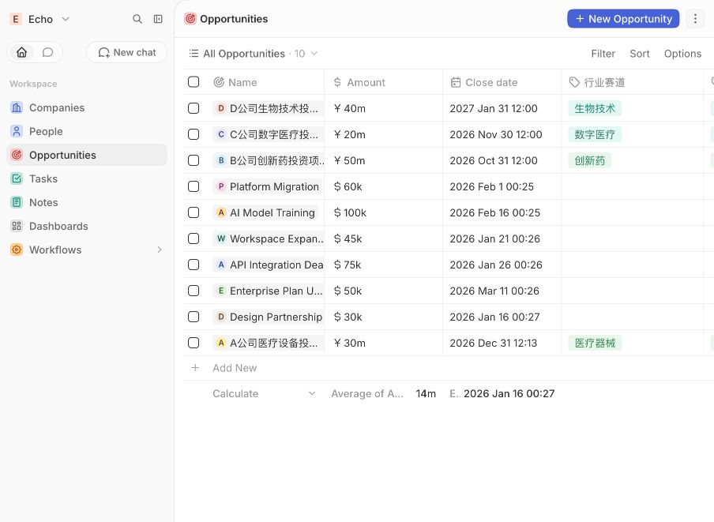
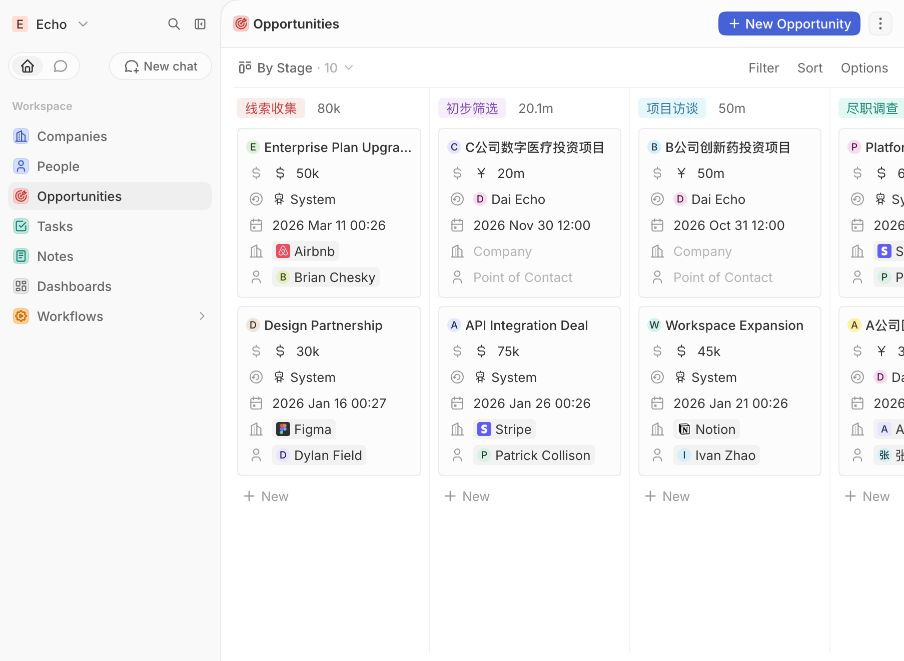
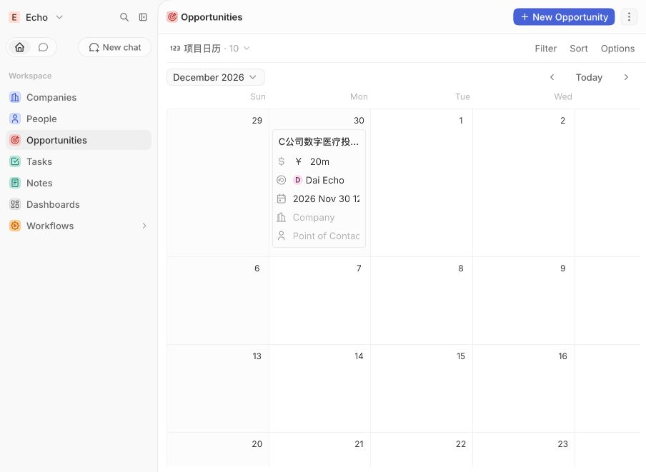

# 生物医药投资项目全流程与投后数据管理平台

> 基于 Twenty CRM 的个人无代码产品实践｜面向产品经理、运营管培生、商务管培生岗位

## 1. 项目定位

这是一个基于真实工作观察抽象出的**个人产品实践**。项目原型来自我在生物医药投资机构担任投资助理期间对项目材料、财务数据、会议记录和推进节点的整理经验，但系统中的公司、联系人、金额及材料状态均为匿名化示例，不包含任何机构或企业机密。

本项目不包装为软件开发经历，重点展示：

- 从业务问题中识别产品机会；
- 将非标准投资流程结构化；
- 设计字段、状态和核心视图；
- 用无代码工具快速搭建 MVP；
- 从产品、运营和商务协同角度设计迭代方案。

## 2. 业务问题

投资项目日常推进中，信息往往分散在 Excel、微信、邮件和会议纪要中，容易出现：

1. 项目当前阶段不清晰，团队需要反复口头同步；
2. 商业计划书、财务报表、知识产权等材料缺失状态难以追踪；
3. 企业联系人、跟进任务和会议记录相互割裂；
4. 多项目并行时，关键日期和下一步行动容易遗漏；
5. 管理者难以快速查看项目分布、风险和推进节奏。

## 3. 目标用户

| 用户 | 核心需求 |
|---|---|
| 投资助理/分析师 | 快速录入项目、跟踪材料、记录访谈与待办 |
| 项目负责人 | 查看阶段、风险、关键节点和下一步行动 |
| 投资团队管理者 | 用统一视图了解项目池和资源投入 |
| 运营/商务协同人员 | 明确联系人、材料责任人和截止时间 |

## 4. 产品目标

- 用一套统一字段承载项目基础信息；
- 用状态机描述项目从线索到投决的推进过程；
- 用表格、看板、日历满足不同角色的查看需求；
- 将“缺什么材料、下一步做什么、何时完成”显性化；
- 在不接触真实敏感数据的前提下完成可演示 MVP。

## 5. 核心流程

`线索收集 → 初步筛选 → 项目访谈 → 尽职调查 → 投决会 → 已投资 / 已终止`

每个项目同时维护行业赛道、项目来源、材料完整度、风险等级、计划日期、联系人、任务和沟通记录。

## 6. MVP 功能

### 6.1 项目数据字段

- 项目名称
- 拟投资金额
- 计划日期
- 行业赛道
- 项目来源
- 材料完整度
- 风险等级
- 项目阶段
- 企业与联系人
- 负责人

### 6.2 三类核心视图

1. **项目总表**：用于集中录入、筛选和横向比较；
2. **项目阶段看板**：用于查看项目在各阶段的分布；
3. **项目日历**：用于管理访谈、尽调、投决等关键日期。

### 6.3 协作记录

- 新建项目沟通记录；
- 记录待补充材料；
- 建立有截止日期的跟进任务；
- 将任务关联至项目、联系人和负责人。

## 7. 匿名化演示数据

| 项目 | 金额 | 赛道 | 来源 | 材料完整度 | 风险 | 阶段 | 计划日期 |
|---|---:|---|---|---|---|---|---|
| A公司医疗设备投资项目 | ¥30m | 医疗器械 | 机构推荐 | 部分齐全 | 中 | 尽职调查 | 2026-12-31 |
| B公司创新药投资项目 | ¥50m | 创新药 | 主动挖掘 | 待收集 | 高 | 项目访谈 | 2026-10-31 |
| C公司数字医疗投资项目 | ¥20m | 数字医疗 | 企业自荐 | 基本齐全 | 低 | 初步筛选 | 2026-11-30 |
| D公司生物技术投资项目 | ¥40m | 生物技术 | 内部转介 | 已齐全 | 中 | 投决会 | 2027-01-31 |

> 金额、公司和联系人均为演示数据，不代表真实投资项目。

## 8. 产品截图

### 项目总表

### 自定义字段

### 项目阶段看板

### 项目日历

## 9. 优先级设计

### P0：必须完成

- 项目基础字段；
- 阶段状态机；
- 材料完整度和风险等级；
- 项目总表与阶段看板；
- 任务、截止日期和负责人。

### P1：提升效率

- 日历视图；
- 项目筛选和排序；
- 标准化沟通记录模板；
- 逾期任务提醒。

### P2：后续迭代

- 项目评分模型；
- 自动提醒和审批工作流；
- 投前与投后数据分层；
- 项目漏斗和风险仪表盘；
- 企业材料权限和审计日志。

## 10. 指标设计

以下是 MVP 阶段的验证指标，而非已经取得的业务结果：

- 项目基础信息完整率；
- 待补材料按时回收率；
- 逾期任务数量；
- 单个项目状态更新耗时；
- 团队查找项目最新信息的平均时间；
- 各阶段项目数量及阶段停留时长。

## 11. 我的工作

- 从投资助理工作场景中梳理用户、痛点和核心流程；
- 将非标准项目推进过程抽象为 7 个阶段；
- 设计行业赛道、项目来源、材料完整度、风险等级等字段；
- 使用 Twenty CRM 搭建表格、看板和日历视图；
- 创建 4 个匿名项目并验证不同阶段、风险和材料状态；
- 设计项目沟通记录和材料跟进任务；
- 输出产品说明、优先级和迭代路线。

## 12. 项目复盘

### 做得较好的地方

- 产品选题来自真实业务，而不是复制通用练手项目；
- 将“文件整理”升级为“项目流程和信息架构设计”；
- 通过匿名化示例规避真实工作资料泄露；
- MVP 功能范围克制，能够完整演示核心流程。

### 可以改进的地方

- 当前没有接入真实多人协作，缺少实际使用数据；
- 项目评分和投后监控仍需进一步定义；
- 提醒、审批和仪表盘尚未完成自动化；
- 后续需要通过用户访谈验证字段是否足够精简。

## 13. 面试时的一句话介绍

我基于自己在生物医药投资机构整理项目材料、财务数据和会议记录的经历，发现项目状态、材料和任务分散的问题，因此用 Twenty CRM 做了一个无代码 MVP，把投资项目从线索到投决的流程结构化，并用表格、看板和日历展示不同角色需要的信息。
